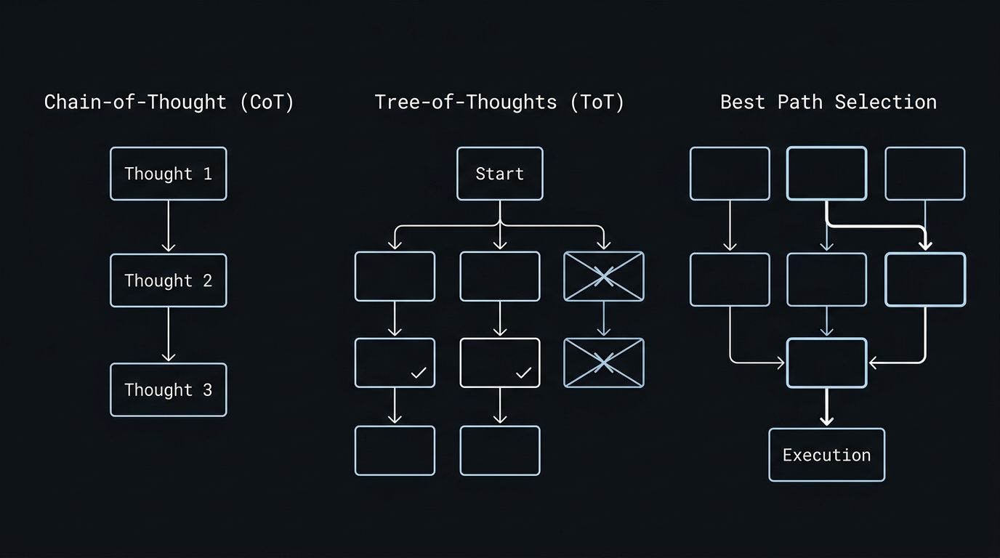

# FastAIReasoner 0.1.0 — Multi-Step Reasoning & Cognitive Planning Engine for Java

[](https://github.com/andrestubbe/FastAIReasoner/releases/tag/0.1.0)
[](https://opensource.org/licenses/MIT)
[](https://www.java.com)
[]()
[](https://jitpack.io/#andrestubbe/FastAIReasoner)

---

**⚡ Multi-step reasoning, Chain-of-Thought (CoT), Tree-of-Thoughts (ToT), and heuristic path evaluation — Deep cognitive planning engine for the FastJava AI ecosystem.**

FastAIReasoner provides structured cognitive search and reasoning capabilities for Java AI agents. It evaluates solution paths, explores branch states, and performs self-consistency verification before actions are executed in `FastAIAgent` or `FastAIRuntime`.

<p align="center">
  
</p>

---

## Quick Start

```java
import fastai.AI;
import fastai.FastAI;
import fastaireasoner.FastAIReasoner;
import fastaireasoner.ReasoningResult;

public class Demo {
    public static void main(String[] args) {
        AI brain = FastAI.connect("ollama:qwen2.5-coder:7b");

        // 1. Instantiate reasoning engine with Tree-of-Thoughts (ToT) strategy
        FastAIReasoner reasoner = FastAIReasoner.treeOfThoughts(brain, 3 /* branches */, 2 /* depth */);

        // 2. Perform deep reasoning on complex architectural problem
        ReasoningResult result = reasoner.reason("Design a lock-free event dispatcher in Java");

        System.out.println("Best Plan: " + result.bestPath());
        System.out.println("Confidence: " + result.confidenceScore());
    }
}
```

---

## Table of Contents

- [Why FastAIReasoner?](#why-fastaireasoner)
- [Key Features](#key-features)
- [Reasoning Strategies](#reasoning-strategies)
- [Architecture Overview](#architecture-overview)
- [API Quick Reference](#api-quick-reference)
- [Installation](#installation)
- [Documentation](#documentation)
- [Platform Support](#platform-support)
- [License](#license)
- [Related Projects](#related-projects)

---

## Why FastAIReasoner?

Standard LLM prompting produces linear, error-prone responses on multi-step logic and coding tasks. `FastAIReasoner` delivers:

- **State-Space Exploration** — Explores alternative reasoning branches before committing to an action.
- **Self-Consistency Scoring** — Samples multiple rationale paths and ranks the most reliable outcome.
- **Agent Integration** — Directly plugs into `FastAIAgent`'s planning and reflection phases.
- **Zero Framework Overhead** — Pure Java 17+ with sub-millisecond graph evaluation.

---

## Key Features

- **🌲 Tree-of-Thoughts (ToT)** — Explores tree-structured rationale paths with branch pruning.
- **🔗 Chain-of-Thought (CoT)** — Step-by-step sequential deduction with explicit verification gates.
- **🎯 Monte Carlo Tree Search (MCTS)** — Rollout simulations and heuristic value scoring for complex goal decomposition.
- **⚡ Fast Reflection & Self-Healing** — Evaluates execution anomalies and generates counter-plans.

---

## Architecture Overview

**FastAIReasoner (The Reasoner & Planning Engine)**  
Evaluates cognitive hypotheses, scores branches, and outputs optimal execution plans.

**[FastAIAgent](https://github.com/andrestubbe/FastAIAgent) (The Mind)**  
Consumes reasoning plans and orchestrates the ReAct loop (`Observe → Plan → Act → Reflect → Memory`).

**[FastAIRuntime](https://github.com/andrestubbe/FastAIRuntime) (The Body)**  
Executes the deterministic tool actions selected by the reasoner.

---

## API Quick Reference

| Method / Factory | Return Type | Description |
|---|---|---|
| `FastAIReasoner.chainOfThought(AI)` | `FastAIReasoner` | Sequential reasoning pipeline with step validation. |
| `FastAIReasoner.treeOfThoughts(AI, int, int)` | `FastAIReasoner` | Branching tree search exploring multiple candidate thoughts. |
| `FastAIReasoner.mcts(AI, int)` | `FastAIReasoner` | Heuristic Monte Carlo search for strategic planning. |
| `reasoner.reason(String goal)` | `ReasoningResult` | Evaluates the goal and returns the highest-scoring plan path. |

---

## Installation

### Option 1: Maven (Recommended)

Add the JitPack repository and the dependencies to your `pom.xml`:

```xml
<repositories>
    <repository>
        <id>jitpack.io</id>
        <url>https://jitpack.io</url>
    </repository>
</repositories>

<dependencies>
    <!-- FastAIReasoner Library -->
    <dependency>
        <groupId>com.github.andrestubbe</groupId>
        <artifactId>FastAIReasoner</artifactId>
        <version>0.1.0</version>
    </dependency>

    <!-- FastAI (Unified AI Client) -->
    <dependency>
        <groupId>com.github.andrestubbe</groupId>
        <artifactId>FastAI</artifactId>
        <version>0.1.0</version>
    </dependency>
</dependencies>
```

### Option 2: Gradle (via JitPack)

```groovy
repositories {
    maven { url 'https://jitpack.io' }
}

dependencies {
    implementation 'com.github.andrestubbe:FastAIReasoner:0.1.0'
    implementation 'com.github.andrestubbe:FastAI:0.1.0'
}
```

### Option 3: Direct Download (No Build Tool)

Download the latest JARs directly to add them to your classpath:

1. 📦 **[fastaireasoner-0.1.0.jar](https://github.com/andrestubbe/FastAIReasoner/releases/download/0.1.0/fastaireasoner-0.1.0.jar)** (The Core Library)
2. ⚙️ **[fastcore-0.1.0.jar](https://github.com/andrestubbe/FastCore/releases/download/0.1.0/fastcore-0.1.0.jar)** (The Mandatory Native Loader)

---

## Documentation

* **[REFERENCE.md](docs/REFERENCE.md)**: Core API reference manual.
* **[PHILOSOPHY.md](docs/PHILOSOPHY.md)**: Multi-step reasoning and cognitive planning architecture.
* **[COMPILE.md](docs/COMPILE.md)**: Build instructions.
* **[CHANGELOG.md](docs/CHANGELOG.md)**: Project history and releases.
* **[ROADMAP.md](docs/ROADMAP.md)**: Future milestones.

---

## Platform Support

| Platform | Status |
|----------|--------|
| Windows 10/11 (x64) | ✅ Fully Supported |
| Linux | 🚧 Planned |
| macOS | 🚧 Planned |

---

## License

MIT License — See [LICENSE](LICENSE) file for details.

---

## Related Projects

- [FastAI](https://github.com/andrestubbe/FastAI) — Unified AI client interface for Java
- [FastAIAgent](https://github.com/andrestubbe/FastAIAgent) — Autonomous agent loop, intent-graphs, and tool execution
- [FastAIBot](https://github.com/andrestubbe/FastAIBot) — Zero-bloat bot harnesses and persona runtime
- [FastAIGraph](https://github.com/andrestubbe/FastAIGraph) — In-memory knowledge graph and multi-hop relationship engine
- [FastAIHybrid](https://github.com/andrestubbe/FastAIHybrid) — Dense-sparse hybrid search fusion (BM25 + Vectors)
- [FastAIMatcher](https://github.com/andrestubbe/FastAIMatcher) — Automated SOX compliance and hybrid rule matching engine
- [FastAIMCP](https://github.com/andrestubbe/FastAIMCP) — Model Context Protocol (MCP) server & tool integration
- [FastAIMemory](https://github.com/andrestubbe/FastAIMemory) — Conversation history, sliding windows, and rolling summaries
- [FastAIMetrics](https://github.com/andrestubbe/FastAIMetrics) — Ultra-fast lock-free token, latency, cost tracking and evaluation engine
- [FastAIModel](https://github.com/andrestubbe/FastAIModel) — Native local inference runtime (GGUF/ONNX)
- [FastAIRag](https://github.com/andrestubbe/FastAIRag) — Ultra-fast document chunking and vector retrieval
- [FastAIReasoner](https://github.com/andrestubbe/FastAIReasoner) — Deterministic planning, chain-of-thought, and self-correction
- [FastAIRerank](https://github.com/andrestubbe/FastAIRerank) — Cross-encoder relevance filtering and Top-N prompt pruner
- [FastAIRuntime](https://github.com/andrestubbe/FastAIRuntime) — Sandboxed process runner and tool-calling execution pipeline
- [FastAIState](https://github.com/andrestubbe/FastAIState) — Lock-free shared agent state & blackboard memory
- [FastAIVectorDB](https://github.com/andrestubbe/FastAIVectorDB) — High-throughput SIMD/AVX2 vector database
- [FastAIVision](https://github.com/andrestubbe/FastAIVision) — High-speed local multimodal vision, UI-element grounding, and screen-VLM engine
- [FastCore](https://github.com/andrestubbe/FastCore) — Unified JNI loader and platform abstraction

---

**Part of the FastJava Ecosystem** — *Making the JVM faster. Small package. Maximum speed. Zero bloat. 🚀📋*